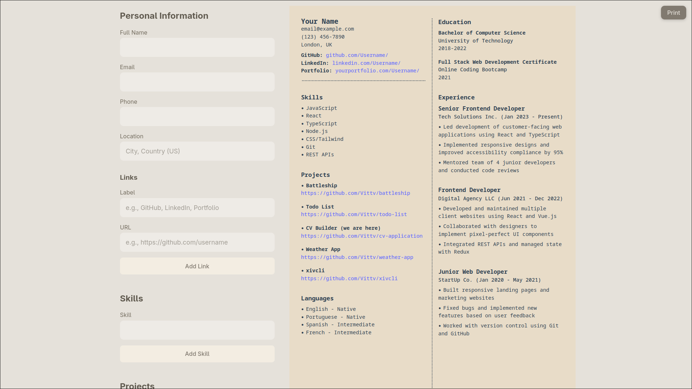

# The Odin Project - Full Stack JavaScript

## #16 Project: CV Application

A CV builder application made in React.



### Features

- Adding all your usual CV information
  - Personal
  - Skills
  - Projects
  - Languages
  - Education
  - Experience

- Printing and saving as PDF
  - You can use the print button in the UI to bring up the browser's print menu, allowing you to save as PDF or print it.

### Building

You can run this app locally by cloning the repo and installing its dependencies:

```
git clone https://github.com/Vittv/cv-application.git
cd cv-application
npm install
```

Then you can open the local server with:

```
npm run dev
```

It should then be available at `http://localhost:5173`.
